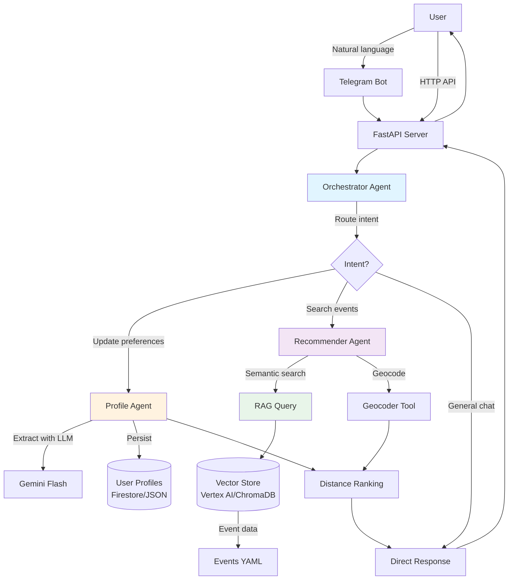

# BCN Art Compass 🎨

**AI-Powered Cultural Events Recommender for Barcelona**

A multi-agent system that learns your art preferences and recommends personalized cultural events using RAG (Retrieval-Augmented Generation), persistent user memory, and location-based scoring.

Built with Google's Agent Development Kit (ADK), deployable on Google Cloud Run, and accessible via FastAPI or Telegram bot.

---

## What It Does

BCN Art Compass helps you discover art exhibitions and cultural events in Barcelona through natural conversation:

**Example Conversation:**

```
You: "I love contemporary art and sculpture"
Bot: "I've updated your preferences! You now have contemporary art and sculpture as favorites."

You: "Show me exhibitions near Gràcia"
Bot: "I found 3 events that might interest you:
     
     1️⃣ Contemporary Sculpture Exhibition at MACBA (2.1 km away)
        💡 Perfect match for your sculpture interest
        📅 Dec 1-31, 2025
        💰 €12 (€8 students)
     
     2️⃣ Textile Art: Threads of Identity at Museu del Disseny (nearby!)
        💡 Contemporary perspective you might enjoy
        📅 Nov 15 - Jan 30
        💰 Free
     ..."
```

### Key Capabilities

- 🧠 **Learns Your Preferences**: Extracts and remembers your favorite genres, artists, and dislikes from natural language
- 🎯 **Personalized Recommendations**: Uses RAG + user profile + location to find the best matches
- 📍 **Location-Aware**: Prioritizes nearby events and shows accurate distances
- 💬 **Natural Conversation**: Chat via FastAPI or Telegram bot
- 🔄 **Persistent Memory**: Remembers preferences across sessions (Firestore in cloud, JSON locally)
- 🚀 **Production-Ready**: Deployed on Google Cloud Run with Vertex AI Vector Search

---

## Architecture

### System Overview



### Agent Responsibilities

| Agent | Purpose | Tools & Functions |
|-------|---------|-------------------|
| **Orchestrator** (Flash) | Routes queries to specialized agents, manages conversation flow | Intent detection via LLM, ADK Runner for multi-agent execution, session management, retry logic with exponential backoff, conversation history compaction |
| **Profile Agent** (Flash) | Manages user preferences and persistent memory | `get_profile_tool`: Load user profile<br>`update_profile_tool`: CRUD operations<br>`extract_preferences_tool`: NLP extraction from text |
| **Recommender Agent** (Flash + Pro ranking) | Discovers and recommends cultural events | `recommend_events_tool`: RAG query + LLM ranking<br>`calculate_distances_tool`: Batch Haversine distance<br>`calculate_single_distance_tool`: Single distance lookup |

### Technology Stack

- **Framework**: Google ADK (Agent Development Kit) with multi-agent Runner
- **LLM**: 
  - Gemini 1.5 Flash for orchestrator and agents (fast routing)
  - Gemini 2.5 Pro for event ranking (better quality)
- **Vector DB**: 
  - Cloud: Vertex AI Vector Search with text-embedding-005
  - Local: ChromaDB with sentence-transformers (all-MiniLM-L6-v2)
- **Memory**: 
  - Cloud: Firestore with automatic TTL
  - Local: JSON files with datetime serialization
- **API**: FastAPI with:
  - REST endpoints (`/chat`)
  - WebSocket streaming (`/ws/chat`)
  - Health probes (`/healthz`, `/readyz`)
- **Observability**: structlog with correlation IDs, timing metrics (rag_ms, runner_ms)
- **Deployment**: 
  - Docker (multi-stage builds)
  - Google Cloud Run
  - Cloud Build for CI/CD
- **IaC**: Terraform for GCP resources (Cloud Run, Vertex AI, Firestore, IAM)

### Project Structure

```
bcn-art-compass/
├── agents/                     # Multi-agent orchestration
│   ├── orchestrator.py         # Main orchestrator with ADK Runner
│   ├── profile_agent_adk.py    # Profile management agent
│   ├── recommender_agent_adk.py # Event recommendation agent
│   ├── event_ranker.py         # LLM-based event ranking
│   ├── prompts.py              # Centralized LLM prompts
│   └── tools/                  # Agent tools
│       ├── profile_tools.py    # Profile CRUD operations
│       ├── recommendation_tools.py # RAG and ranking
│       └── distance_tools.py   # Geographic distance calculations
├── api/                        # FastAPI application
│   └── main.py                 # API endpoints and lifecycle
├── memory/                     # User profile storage
│   ├── models.py               # UserProfile Pydantic model
│   ├── storage.py              # JSON-based persistence
│   └── storage_firestore.py    # Firestore backend
├── rag/                        # RAG and vector search
│   ├── models.py               # Event/Venue Pydantic models
│   ├── embeddings.py           # Google API embeddings
│   ├── vector_store.py         # ChromaDB implementation
│   └── vector_store_vertex.py  # Vertex AI Vector Search
├── tools/                      # Shared tools
│   ├── geocoder.py             # Location geocoding
│   └── event_search.py         # Event search tool
├── data/                       # Event and venue data
│   ├── events.yaml             # Cultural events database
│   └── venues.yaml             # Venue information
├── scripts/                    # Deployment and utilities
│   ├── deployment/             # Cloud deployment scripts
│   │   ├── deploy.sh           # Main deployment script
│   │   └── deploy_with_vertex.sh # Vertex AI deployment
│   └── vertex/                 # Vertex AI management
│       └── update_vertex_index.sh # Update embeddings
├── terraform/                  # Infrastructure as Code
│   ├── main.tf                 # GCP resources
│   └── variables.tf            # Configuration variables
├── cli.py                      # Interactive CLI
├── cli_vertex.sh               # CLI with Vertex AI
├── run_api_vertex.sh           # Run API locally with Vertex AI
├── config.py                   # Environment detection
└── pyproject.toml              # Project configuration
```

---

## Features

### Core Features

- ✅ **Multi-Agent Architecture**: Orchestrator (Gemini Flash) coordinates specialized Profile and Recommender agents
- ✅ **Natural Language Understanding**: Extract preferences from conversational input using Gemini LLM
- ✅ **RAG-Powered Search**: Semantic search using Vertex AI Vector Search (cloud) or ChromaDB (local)
- ✅ **LLM-Based Ranking**: Gemini Pro analyzes events against user profile and query intent for intelligent ranking
- ✅ **Location-Based Filtering**: Haversine distance calculation with geocoding support for Barcelona neighborhoods and metro stations
- ✅ **Persistent Memory**: User profiles saved across sessions (Firestore in cloud, JSON locally)
- ✅ **Conversation History**: Session management with automatic compaction (last 5 turns + 2 overlap)
- ✅ **Retry Logic**: Automatic retry with exponential backoff for API quota errors (429)

### Technical Features

- ✅ FastAPI server with health checks (`/healthz`, `/readyz`) and CORS support
- ✅ WebSocket streaming endpoint (`/ws/chat`) for real-time event streaming (to be properly implemented)
- ✅ Structured logging (structlog) with correlation IDs for request tracing
- ✅ Cloud/Local auto-detection (Firestore vs JSON, Vertex AI vs ChromaDB)
- ✅ Docker containerization with multi-stage builds
- ✅ Terraform infrastructure as code
- ✅ Comprehensive test suite (52+ tests including async, tools, and integration tests)

### Supported Data

- **Event Types**: Art exhibitions, museums, galleries, street art tours, art fairs
- **Not Supported**: Music concerts, theater, sports events (system will politely decline)

---

## Quick Start

### Prerequisites

1. **Python 3.12+**
2. **[uv](https://github.com/astral-sh/uv)** package manager:
   ```bash
   curl -LsSf https://astral.sh/uv/install.sh | sh
   ```
3. **Google API Key** (for Gemini LLM):
   - Get one at: https://aistudio.google.com/app/apikey
4. **gcloud CLI** (for cloud deployment):
   ```bash
   # macOS
   brew install --cask google-cloud-sdk
   
   # Other platforms: https://cloud.google.com/sdk/docs/install
   ```

### How to Run It Locally

#### Option 1: Simple Local Setup (ChromaDB + JSON)

```bash
# Clone the repository
git clone <repo-url>
cd bcn-art-compass

# Install dependencies
uv sync

# Set your API key
echo "GOOGLE_API_KEY=your-api-key-here" > .env

# Initialize the vector store
PYTHONPATH=$PWD uv run python scripts/data/init_vector_store.py

# Run the API server
uv run python api/main.py
```

The API will be available at `http://localhost:8000`.

**Test it:**
```bash
# REST endpoint
curl -X POST http://localhost:8000/chat \
  -H "Content-Type: application/json" \
  -d '{"message": "Show me contemporary art exhibitions", "user_id": "test"}'

# WebSocket endpoint (using websocat or similar)
# Connect to ws://localhost:8000/ws/chat
# Send: {"user_id": "test", "message": "Show me art near MACBA"}
# Receive streaming events: {type: "token|tool|final", content: "...", seq: 1}
```

**Available Endpoints:**
- `POST /chat` - Synchronous chat (returns complete response)
- `WS /ws/chat` - WebSocket streaming (real-time events, for now it just falls back to the synchronous implementation)
- `GET /healthz` - Liveness probe
- `GET /readyz` - Readiness probe (checks orchestrator)

#### Option 2: CLI Interface

```bash
# Set your API key
export GOOGLE_API_KEY="your-api-key-here"

# Start interactive CLI
uv run python cli.py
```

You'll get a conversational interface:
```
Welcome to BCN Art Compass! 🎨

Tell me what kind of art you're interested in, and I'll help you discover
exhibitions and galleries in Barcelona.

You can:
- Share your preferences: "I love contemporary sculpture"
- Ask for recommendations: "Show me exhibitions near Gràcia"
- Update your profile: "I don't like video art"

Type 'quit' to exit.

You: 
```

#### Option 3: Local with Vertex AI

If you want to use Vertex AI Vector Search locally:

```bash
# Authenticate with Google Cloud
gcloud auth application-default login --project=bcn-art-compass

# Set your API key
echo "GOOGLE_API_KEY=your-api-key-here" > .env

# Run with Vertex AI
./run_api_vertex.sh
```

This auto-discovers your Vertex AI index and runs the API with cloud-based RAG.

---

## How to Deploy to Google Cloud

### Prerequisites

1. **Google Cloud Project** with billing enabled
2. **gcloud CLI** authenticated:
   ```bash
   gcloud auth login
   gcloud config set project bcn-art-compass
   ```
3. **Enable required APIs** (handled by deploy script):
   - Cloud Run API
   - Cloud Build API
   - Secret Manager API
   - Vertex AI API
   - Firestore API

### Step 1: Setup API Key Secret (One-Time)

```bash
./scripts/setup-api-key-secret.sh
```

This will:
- Create a secret named `google-api-key` in Secret Manager
- Prompt you to enter your API key securely
- Grant Cloud Run access to the secret

### Step 2: Initialize Terraform Infrastructure

```bash
cd terraform

# Create terraform.tfvars
cat > terraform.tfvars << EOF
project_id = "bcn-art-compass"
region = "europe-southwest1"
use_vertex_rag = true
EOF

# Initialize and apply
terraform init
terraform apply
```

This creates:
- GCS bucket for embeddings
- Vertex AI Vector Search index
- Index endpoint
- Cloud Run service
- IAM roles and permissions

### Step 3: Upload Embeddings to Vertex AI

```bash
cd ..
./scripts/vertex/update_vertex_index.sh
```

This will:
- Generate embeddings from `data/events.yaml` and `data/venues.yaml`
- Upload to GCS
- Trigger Vertex AI index rebuild

### Step 4: Deploy to Cloud Run

```bash
./scripts/deployment/deploy.sh --with-vertex
```

This will:
- Build Docker image via Cloud Build
- Deploy to Cloud Run with:
  - 1Gi memory
  - 120s timeout
  - Vertex AI environment variables
  - Secret Manager integration
- Auto-discover Vertex AI index endpoint

### Step 5: Test the Deployment

```bash
# Get your service URL
export SERVICE_URL=$(gcloud run services describe bcn-art-compass \
  --region=europe-southwest1 \
  --format="value(status.url)")

# Test health
curl $SERVICE_URL/healthz

# Test chat
curl -X POST $SERVICE_URL/chat \
  -H "Content-Type: application/json" \
  -d '{"message": "Show me art exhibitions near MACBA", "user_id": "test"}'
```

---

## Development

### Running Tests

```bash
# Run all tests
uv run pytest -v

# Run specific test suites
uv run pytest tests/test_orchestrator_injected.py -v
uv run pytest tests/test_profile_tools_async.py -v
uv run pytest tests/test_event_ranker.py -v

# Run with coverage
uv run pytest --cov=agents --cov=memory --cov=rag --cov=tools
```

### Code Quality

```bash
# Lint code
uv run ruff check .

# Auto-fix issues
uv run ruff check --fix .

# Format code
uv run ruff format .
```

### Adding New Events

Edit `data/events.yaml`:

```yaml
- event_id: "my-new-event"
  title: "Amazing Art Exhibition"
  description: "A stunning collection of contemporary works..."
  start_date: "2026-01-15"
  end_date: "2026-03-30"
  venue_id: "macba"
  genres:
    - "contemporary art"
    - "painting"
  featured_artists:
    - "Artist Name"
  price_range: "€10-15"
  url: "https://example.com/amazing-art"
```

Then regenerate embeddings:

```bash
# For local ChromaDB
PYTHONPATH=$PWD uv run python scripts/data/init_vector_store.py

# For Vertex AI
./scripts/vertex/update_vertex_index.sh
```

### Environment Variables

| Variable | Description | Default | Required |
|----------|-------------|---------|----------|
| `GOOGLE_API_KEY` | Gemini API key | - | ✅ Yes |
| `GOOGLE_CLOUD_PROJECT` | GCP project ID | `bcn-art-compass` | Cloud only |
| `GOOGLE_CLOUD_LOCATION` | GCP region | `europe-southwest1` | Cloud only |
| `USE_VERTEX_RAG` | Use Vertex AI for RAG | `false` | No |
| `USE_FIRESTORE` | Use Firestore for profiles | `false` | No |
| `USE_LOCAL_LLM` | Use local LLM (deprecated) | `false` | No |
| `BCN_LOG_LEVEL` | Logging level | `INFO` | No |
| `VERTEX_INDEX_ENDPOINT` | Vertex AI endpoint | Auto-discovered | With Vertex |
| `VERTEX_DEPLOYED_INDEX_ID` | Deployed index ID | Auto-discovered | With Vertex |

### Debug Logging

```bash
# CLI with debug logs
BCN_LOG_LEVEL=DEBUG uv run python cli.py

# API with debug logs
BCN_LOG_LEVEL=DEBUG uv run python api/main.py

# Telegram bot with debug logs
# In bcn-art-compass-telegram-bot/.env
BCN_BOT_LOG_LEVEL=DEBUG
```

---

## Monitoring

### Cloud Run Logs

```bash
# View recent logs
gcloud run services logs read bcn-art-compass \
  --region=europe-southwest1 \
  --limit=50

# Follow logs in real-time
gcloud run services logs tail bcn-art-compass \
  --region=europe-southwest1

# Filter by correlation ID
gcloud logging read "resource.type=cloud_run_revision \
  AND jsonPayload.correlation_id=YOUR_CORRELATION_ID" \
  --limit=50 \
  --format=json
```

### Key Metrics to Monitor

**Structured logs include:**
- `event: session_retrieved` - Session loaded
- `event: runner_starting` - Orchestrator starting
- `event: runner_first_event_received` - First LLM response
- `event: rag_query_start` - RAG search starting
- `event: rag_query_complete`, `rag_ms` - RAG timing
- `event: runner_complete`, `runner_ms` - Total orchestrator time
- `event: chat_response_generated` - Response sent

**Example log query:**
```bash
# Find slow queries (>30s)
gcloud logging read "resource.type=cloud_run_revision \
  AND jsonPayload.event=runner_complete \
  AND jsonPayload.runner_ms>30000" \
  --limit=20
```

### Health Checks

- **`GET /healthz`**: Liveness probe (always returns 200 if running)
- **`GET /readyz`**: Readiness probe (checks if orchestrator initialized)

### Performance Benchmarks

| Operation | Local (ChromaDB) | Cloud (Vertex AI) |
|-----------|------------------|-------------------|
| **Orchestrator init** | ~3-5s | ~3-5s |
| **Simple chat** | ~5-8s | ~5-8s |
| **RAG query** | ~3-5s | ~1-2s (after warmup) |
| **LLM ranking** | ~2-4s | ~2-4s |
| **Profile update** | ~0.5-1s | ~0.5-1s |
| **Total (RAG + ranking)** | ~10-15s | ~8-12s |
| **Cold start (Cloud Run)** | N/A | ~10-15s |

**Key Timing Metrics** (logged with correlation_id):
- `runner_starting` → `runner_first_event_received`: LLM processing time
- `rag_query_start` → `rag_query_complete` (`rag_ms`): Vector search time
- `runner_starting` → `runner_complete` (`runner_ms`): Total orchestration time

**Optimization tips:**
- ✅ Already using `gemini-1.5-flash` for orchestrator (3-5s vs 10-15s with Pro)
- ✅ Already using `gemini-2.5-pro` for ranking (better quality than Flash)
- ✅ Enable Vertex AI for production (faster RAG, <2s vs 3-5s with ChromaDB)
- 📊 Monitor `rag_ms` and `runner_ms` in structured logs
- 🔄 Retry logic handles 429 errors automatically with parsed `retryDelay`

---

## Troubleshooting

### Common Issues

**Import errors (`ModuleNotFoundError: No module named 'tools'`)**:
- Run `uv sync` to reinstall packages
- Check that `pyproject.toml` includes `tools*` in `include` list

**API key invalid**:
- Get a fresh key from https://aistudio.google.com/app/apikey
- Ensure no trailing newlines: `echo -n "key" > .env`

**Vertex AI timeouts**:
- Check `rag_ms` in logs (should be <5s)
- Verify API key is clean (no newlines)
- Check IAM permissions for service account

**Cloud Run startup probe fails**:
- Check logs: `gcloud run services logs read bcn-art-compass --limit=50`
- Verify all imports work locally
- Ensure memory limit is sufficient (1Gi+)

**Telegram bot not responding**:
- Check bot logs for errors
- Verify `BCN_API_BASE_URL` in `.env`
- Test backend with `curl` to isolate issue

---

## License

MIT License - see LICENSE file for details
