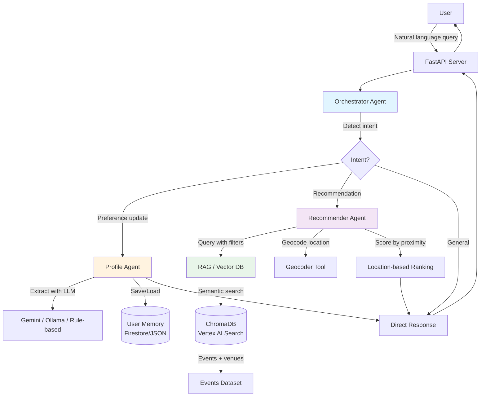

# BCN Art Compass 🎨

**AI-Powered Cultural Events Recommender for Barcelona**

Multi-agent LLM system that learns your preferences and recommends cultural events using RAG, user memory, and location-based scoring. Built with Google ADK and deployable on Cloud Run.

## 🎯 What It Does

Ask in natural language, get personalized art recommendations:

```
You: "I love contemporary art and sculpture"
Bot: "I've updated your preferences! You now have contemporary art and sculpture as favorites."

You: "Show me exhibitions near Gràcia"
Bot: "I found 3 events that might interest you:
     1. **Contemporary Sculpture Exhibition** at MACBA (2.1 km away)
        🎨 contemporary art, sculpture
        💰 €12-15
        ..."
```

The system remembers your preferences across conversations and uses them to personalize future recommendations.

## 🏗️ Architecture



### Agent Responsibilities

| Agent | Purpose | Key Functions |
|-------|---------|---------------|
| **Orchestrator** | Routes queries, manages conversation flow | Intent detection, agent coordination, context tracking |
| **ProfileAgent** | Manages user preferences and memory | Extract preferences (NLP), persist profile, load history |
| **RecommenderAgent** | Generates personalized recommendations | RAG query, profile-based scoring, location ranking |

## 📊 Project Status

✅ **Milestone 0** - Setup  
✅ **Milestone 1** - Minimal RAG + Orchestrator  
✅ **Milestone 2** - Profile Memory  
✅ **Milestone 3** - Preference Extraction  
✅ **Milestone 4** - Clean Multi-Agent Workflow  
✅ **Milestone 5** - Local Demo + CLI + Docker  
✅ **Milestone 6** - Cloud Run Deployment  
✅ **Milestone 7** - Final MVP Hardening  

**🎉 MVP COMPLETE - Production Ready!**

### ⚡ Async Streaming (run_async) Overview

The orchestrator now supports an experimental async path using `Agent.run_async`.

Key points:
- Falls back automatically to sync generation if `run_async` is unavailable or errors.
- Streams events; captures final response from `response|ai_response|final` event types.
- Lightweight tool tracing: tool call/result/error events appended as `tool:<name>:ok|error` entries in session history.
- Session history remains minimal (user + model + tool traces) to control token growth.
- Future improvement: persist full tool outputs and intermediate reasoning events.

Usage (API already async aware):
```python
resp = await orchestrator.chat_async(user_id="u123", message="Recommend exhibitions near Poblenou")
```

If streaming is unsupported, the system transparently returns the sync response:
```python
resp = orchestrator.chat("u123", "Recommend exhibitions")  # sync fallback
```

Testing:
```bash
uv run pytest tests/test_orchestrator_run_async.py -v
```

Design constraints (MVP):
- No buffering of partial tokens (only final response captured)
- Tool outputs summarized (name + status) for transparency
- Shared message builder `_build_messages` ensures consistency between sync and async paths
- Dedicated `_sync_fallback` isolates fallback logic

Planned next steps:
- Stream partial tokens to client websockets
- Persist structured event log for observability and replay
- Rich tool result embedding into final answer synthesis

### 🌐 Real-Time WebSocket Streaming

The API exposes a WebSocket endpoint at `/ws/chat` for incremental delivery of tool and model events.

Client handshake:
1. Connect: `wss://<host>/ws/chat`
2. Send JSON: `{"user_id": "demo", "message": "Show me sculpture exhibitions near Raval"}`
3. Receive frames until `type = "final"` (or send `{"command":"cancel"}` to abort).

Frame schema:
```jsonc
{ "type": "token" | "tool" | "final" | "error" | "info",
  "content": "partial text or final answer",   // null for tool frames
  "tool": "event_search",                      // only for tool frames
  "status": "started" | "ok" | "error",     // tool state
  "seq": 7,                                     // monotonically increasing
  "correlation_id": "<uuid>" }                // tracing id
```

Example Python client:
```python
import asyncio, json, websockets

async def main():
  async with websockets.connect("ws://localhost:8000/ws/chat") as ws:
    await ws.send(json.dumps({"user_id": "demo", "message": "Recommend contemporary sculpture"}))
    async for msg in ws:
      frame = json.loads(msg)
      if frame["type"] == "tool":
        print("[tool]", frame["tool"], frame["status"])
      elif frame["type"] == "token":
        print(frame["content"], end="", flush=True)
      elif frame["type"] == "final":
        print("\nFinal:", frame["content"])
        break
asyncio.run(main())
```

Cancellation:
```json
{"command": "cancel"}
```

Fallback behavior:
- If streaming unavailable internally, endpoint emits a single `final` frame.
- Errors produce an `error` frame then close.

Testing:
```bash
uv run pytest tests/test_ws_streaming.py -v
```

Future enhancements:
- SSE endpoint for environments where WebSocket is blocked
- Emit latency metrics per tool frame
- Stream structured preference updates mid-session


## ✨ Features

### Core Capabilities
- 🤖 **3-Agent Architecture**: Orchestrator, Profile, and Recommender agents working together
- 🧠 **Learns Your Preferences**: Natural language preference extraction with multiple backends
- 🎯 **Personalized Recommendations**: Profile-aware scoring (+0.2 boost for favorites, -0.3 penalty for dislikes)
- 📍 **Location-Aware**: Distance-based ranking (nearby events ranked higher)
- 💬 **Conversational Interface**: CLI and API for natural language interaction
- 🔄 **Memory Across Sessions**: Persistent user profiles in Firestore or local JSON

### Technical Features
- ✅ FastAPI server with health endpoints (/healthz, /readyz)
- ✅ Structured logging with correlation IDs for request tracing
- ✅ RAG search using ChromaDB (local) or Vertex AI Vector Search (cloud)
- ✅ **Free local embeddings option** (sentence-transformers) or Google Gemini embeddings
- ✅ **3 LLM backends for preference extraction**:
  - Google Gemini (cloud, high quality)
  - Ollama/Llama (local, free, good quality)
  - Rule-based fallback (zero dependencies)
- ✅ Multi-agent orchestrator with intent detection
- ✅ **Interactive CLI** for conversational event discovery
- ✅ **Docker & Docker Compose** support
- ✅ **Cloud Run deployment** with auto-detection (Firestore/JSON, Vertex/ChromaDB)
- ✅ 15 cultural events with venue data (expandable)
- ✅ Event search & geocoding MCP tools
- ✅ **52 passing tests** (unit, integration, Docker, Firestore)
- ✅ **Evaluation framework** for testing agent quality

## Quick Start

### Prerequisites

- Python 3.12+
- [uv](https://github.com/astral-sh/uv) package manager
- (Optional) Google API key for Gemini LLM

### Installation

```bash
# Install dependencies
uv sync

# Set Google API key (required for preference extraction)
export GOOGLE_API_KEY=your-api-key-here
```

### Choose Your Embedding Option

The system supports both **free local embeddings** and **Google API embeddings**. You can control which one to use:

### Choose Your LLM for Preference Extraction

The system supports three modes for extracting user preferences from natural language:

#### Option 1: Rule-Based (Default, Zero Cost, No Setup) 💡

Uses simple keyword matching to extract preferences. No API key or local model needed!

```bash
# Just run the CLI - it will auto-detect and use rule-based
uv run python cli.py
```

**Capabilities:**
- Detects likes: "I love contemporary art"
- Detects dislikes: "I don't like video art"
- Recognizes common art genres
- No external dependencies

#### Option 2: Google Gemini (Cloud, Best Quality) ☁️

Uses Google's Gemini-1.5-flash for the most accurate extraction.

```bash
# Set API key
export GOOGLE_API_KEY='your-api-key-here'

# Run CLI (will auto-detect API key)
uv run python cli.py

# Or explicitly force Gemini
USE_LOCAL_LLM=false uv run python cli.py
```

**Comparison:**

| Feature | Rule-Based | Ollama | Gemini |
|---------|------------|--------|--------|
| **Cost** | Free | Free | ~$0.00002/request |
| **Setup** | None | Install Ollama | API key |
| **Quality** | Basic | Good | Best |
| **Privacy** | Local | Local | Cloud |
| **Artists** | ❌ | ✅ | ✅ |
| **Locations** | ❌ | ✅ | ✅ |
| **Complex statements** | Limited | ✅ | ✅ |

**Recommendation:** Start with rule-based for instant setup, upgrade to Ollama for better quality while staying 100% free and local.

### Choose Your Embedding Option

The system supports both **free local embeddings** and **Google API embeddings** for RAG search:

#### Auto-Detection (Default)
- No API key → Uses **local embeddings** (free)
- API key present → Uses **Google API embeddings** (paid)

#### Explicit Control via Flag

Use `USE_LOCAL_EMBEDDINGS` environment variable to explicitly choose:

```bash
# Force local embeddings (even if API key is set)
export USE_LOCAL_EMBEDDINGS=true
PYTHONPATH=$PWD uv run python scripts/init_vector_store.py

# Force Google API embeddings (requires API key)
export GOOGLE_API_KEY='your-api-key-here'
export USE_LOCAL_EMBEDDINGS=false
PYTHONPATH=$PWD uv run python scripts/init_vector_store.py
```

#### Option 1: Free Local Embeddings (Default, Zero Cost) 💡

Uses `sentence-transformers` (all-MiniLM-L6-v2 model, 384 dimensions).
**No API key needed, completely free!**

```bash
# Initialize the vector store
PYTHONPATH=$PWD uv run python scripts/init_vector_store.py

# Run the demo
PYTHONPATH=$PWD uv run python scripts/demo_rag.py

# Start the API server
uv run python main.py
```

#### Option 2: Google API Embeddings (Better Quality, ~$0.00001 per 1K chars)

Uses Google's `text-embedding-004` model (768 dimensions).

```bash
# Set your Google API key
export GOOGLE_API_KEY='your-api-key-here'

# Initialize the vector store (will auto-use Google API)
PYTHONPATH=$PWD uv run python scripts/init_vector_store.py

# Or explicitly force it
export USE_LOCAL_EMBEDDINGS=false
PYTHONPATH=$PWD uv run python scripts/init_vector_store.py

# Run the demo
PYTHONPATH=$PWD uv run python scripts/demo_rag.py

# Start the API server
uv run python main.py
```

### Testing

```bash
# Run all tests
uv run pytest -v

# Run tests including optional embedding tests (requires GOOGLE_API_KEY)
uv run pytest -v --run-embedding-tests

# Run only smoke tests (integration tests for deployed service)
uv run pytest -m smoke

# Run smoke tests with service URL
SERVICE_URL=https://your-service-url.run.app uv run pytest -m smoke

# Exclude smoke tests from regular test run
uv run pytest -m "not smoke"
```

### Running the Application

#### Option 1: Interactive CLI (Recommended for Local Use)

```bash
# Start the conversational CLI interface
uv run python cli.py
```

The CLI provides an interactive chat experience:
- Ask for event recommendations
- Update preferences in natural language
- Multi-turn conversations with context
- Graceful exit with 'quit' or Ctrl+C

#### Option 2: FastAPI Server

```bash
# Start the API server
uv run python main.py
```

The API will be available at `http://localhost:8000`.

#### Option 3: Docker

```bash
# Copy environment template
cp .env.example .env
# Edit .env and add your GOOGLE_API_KEY

# Build and start with Docker Compose
docker-compose up -d

# Check health
curl http://localhost:8000/healthz

# Stop
docker-compose down
```

### Demos

```bash
# Demo 1: Basic RAG recommendations
PYTHONPATH=$PWD uv run python scripts/demo_rag.py

# Demo 2: Preference extraction and personalization
PYTHONPATH=$PWD uv run python scripts/demo_preferences.py
```

### Embedding Options Comparison

| Feature | Local Embeddings | Google API Embeddings |
|---------|-----------------|----------------------|
| **Cost** | 💰 Free | ~$0.00001 per 1K chars |
| **API Key Required** | ❌ No | ✅ Yes (GOOGLE_API_KEY) |
| **Dimensions** | 384 | 768 |
| **Model** | all-MiniLM-L6-v2 | text-embedding-004 |
| **Download Size** | ~91 MB (one-time) | None |
| **Quality** | Good for demos/dev | Production-grade |
| **Speed** | Fast (local) | Depends on network |

**Recommendation**: Start with local embeddings for development, switch to Google API for production if you need higher quality.

### API Endpoints

- `GET /` - Root endpoint with service info
- `GET /healthz` - Liveness probe (always returns 200)
- `GET /readyz` - Readiness probe (returns 200 when orchestrator is ready, 503 otherwise)
- `POST /chat` - Chat with the recommender

Example:
```bash
curl -X POST http://localhost:8000/chat \
  -H "Content-Type: application/json" \
  -d '{"message": "Show me contemporary art exhibitions", "user_id": "test_user"}'
```

### Health Endpoints

The service provides Kubernetes-compatible health checks:

- **`/healthz`** (Liveness): Returns 200 if the application is running. Container orchestrators use this to determine if the container should be restarted.
- **`/readyz`** (Readiness): Returns 200 if the application is ready to serve traffic, 503 otherwise. Checks that the orchestrator is initialized.

```bash
# Check liveness
curl http://localhost:8000/healthz

# Check readiness
curl http://localhost:8000/readyz
```

## Project Structure

```
bcn-art-compass/
├── agents/              # Multi-agent orchestration (M4)
│   ├── orchestrator.py # Orchestrator with conversation tracking
│   ├── profile_agent.py # Profile management & preference extraction
│   └── recommender_agent.py # Dedicated recommendation agent (M4)
├── api/                 # FastAPI application
│   └── main.py         # API endpoints with health checks (M5)
├── cli.py              # Interactive CLI interface (M5)
├── config.py           # Cloud configuration & environment detection (M6)
├── data/                # Event and venue data
│   ├── events.yaml     # 15 cultural events
│   └── venues.yaml     # 12 venues in Barcelona
├── memory/              # User profile storage (M2)
│   ├── models.py       # UserProfile Pydantic model
│   ├── storage.py      # JSON-based persistence
│   └── storage_firestore.py # Firestore backend (M6)
├── observability/      # Structured logging
│   └── log_event.py   # Logging with correlation IDs
├── rag/                # RAG vector search
│   ├── models.py       # Pydantic models for events/venues
│   ├── embeddings.py   # Google Gemini embedding generation
│   ├── embeddings_local.py  # Local sentence-transformers (free!)
│   ├── vector_store.py # ChromaDB with profile-aware scoring
│   ├── vector_store_vertex.py # Vertex AI Vector Search (M6)
│   └── data_loader.py  # YAML data loading
├── scripts/            # Utility and deployment scripts
│   ├── deployment/    # Cloud Run deployment scripts
│   │   ├── deploy.sh           # Deploy to Cloud Run
│   │   ├── deploy_with_vertex.sh  # Deploy with Vertex AI
│   │   └── test_docker.sh      # Docker build validation
│   ├── data/          # Data and index management
│   │   ├── build_chromadb_index.py   # Build local ChromaDB
│   │   ├── prepare_vertex_data.py    # Prepare Vertex embeddings
│   │   └── init_vector_store.py      # Initialize vector stores
│   └── vertex/        # Vertex AI management
│       ├── setup_vertex_ai.sh        # Setup Vertex AI
│       ├── update_vertex_index.sh    # Update index
│       ├── check_vertex_status.sh    # Check status
│       └── cli_vertex.sh             # Vertex CLI commands
├── storage/            # Local data storage (generated, gitignored)
│   ├── chromadb/       # ChromaDB persistence
│   └── .gitkeep        # Keep directory structure
├── tests/              # Test suite (52 tests)
│   ├── integration/    # Integration tests
│   │   └── test_smoke.py  # Smoke tests for deployed service (M6)
│   ├── test_api.py    # API integration tests
│   ├── test_memory.py  # Memory storage tests
│   ├── test_firestore_storage.py  # Firestore tests (M6)
│   ├── test_preference_extraction.py  # Preference extraction
│   ├── test_integration_preferences.py  # End-to-end flow
│   ├── test_docker_integration.py  # Docker service tests (M5)
│   └── test_rag.py    # RAG component tests
├── tools/              # MCP tools
│   ├── event_search.py # Event search tool using RAG
│   └── geocoder.py    # Mock geocoding tool (M4)
├── cloudbuild.yaml    # Google Cloud Build config (M6)
├── Dockerfile         # Multi-stage Docker build (M5)
├── docker-compose.yml # Local Docker orchestration (M5)
├── .dockerignore      # Docker build exclusions (M5)
├── .env.example       # Environment template (M5)
├── main.py            # Application entry point
└── pyproject.toml     # Project configuration
```

## Key Features Explained

### 🤖 Multi-Agent Architecture (Milestone 4)

The system uses a clean 3-agent architecture with dedicated responsibilities:

**OrchestratorAgent** (Coordinator)
- Routes queries to appropriate agents
- Tracks conversation history (last 10 interactions per user)
- Manages multi-turn context
- Provides final user-facing responses

**ProfileAgent** (Memory Manager)
- Extracts preferences from natural language using Gemini LLM
- Manages user profile persistence (JSON storage)
- Tracks likes, dislikes, favorite artists, location

**RecommenderAgent** (RAG Specialist)
- Queries vector store with profile-aware scoring
- Ranks and formats event recommendations
- Delegates to VectorStore for semantic search

### 🎯 Natural Language Preference Extraction (Milestone 3)

Users can express preferences in natural language, and the system extracts structured data:

```python
# User input: "I don't like video art"
# System extracts: {"disliked_genres": ["video art"]}

# User input: "I love contemporary sculpture and Picasso"
# System extracts: {
#   "favorite_genres": ["contemporary sculpture"],
#   "favorite_artists": ["Picasso"]
# }
```

**How it works:**
1. **Intent Detection**: Orchestrator detects preference expressions using keyword matching
2. **LLM Extraction**: ProfileAgent uses Gemini to parse natural language into structured JSON
3. **Profile Update**: Extracted preferences are merged with existing profile
4. **Persistence**: Profile is saved to `storage/user_profiles.json`
5. **Personalization**: Future queries use profile to adjust RAG scoring

**Example conversation:**
```
User: "Show me contemporary art exhibitions"
→ System returns recommendations

User: "I don't like video art"
→ Profile updated: disliked_genres = ["video art"]

User: "Find me interesting exhibitions"
→ System returns recommendations, video art events ranked lower
```

### 🔍 Profile-Aware RAG Scoring (Milestone 2)

The vector store applies preference-based adjustments to search results:

- **Favorite genres**: +0.2 score boost
- **Disliked genres**: -0.3 score penalty
- Results are re-ranked by adjusted scores

### 💾 User Profile Persistence (Milestone 2)

Each user has a profile stored in JSON:

```json
{
  "user_id": "user123",
  "favorite_genres": ["contemporary art", "sculpture"],
  "disliked_genres": ["video art"],
  "favorite_artists": ["Picasso", "Miró"],
  "location": null,
  "created_at": "2025-11-20T...",
  "updated_at": "2025-11-20T..."
}
```

## Development

### Running Tests

The project includes a comprehensive test suite with 52 passing tests covering unit, integration, Docker, and Firestore scenarios.

```bash
# Run all tests
uv run pytest tests/ -v

# Run specific test suites
uv run pytest tests/test_preference_extraction.py -v  # 11 tests
uv run pytest tests/test_integration_preferences.py -v  # 4 tests
uv run pytest tests/test_memory.py -v  # 9 tests
uv run pytest tests/test_firestore_storage.py -v  # 9 tests
uv run pytest tests/test_api.py -v  # 7 tests

# Run Docker integration tests (requires Docker running)
RUN_DOCKER_TESTS=true uv run pytest tests/test_docker_integration.py -v

# Or use the test script
./scripts/test_docker.sh
```

**Test Coverage by Feature:**
- ✅ Preference extraction with all 3 LLM backends
- ✅ Profile persistence (JSON and Firestore)
- ✅ RAG vector search with profile-aware scoring
- ✅ Multi-agent orchestration and routing
- ✅ API endpoints (chat, health, readiness)
- ✅ Docker containerization
- ✅ End-to-end user flows

### Agent Evaluation Framework (Milestone 7)

Test agent quality with predefined test cases:

```bash
# Run evaluation on all test cases
uv run python -m evaluation.agent_eval

# Run with verbose output
uv run python -m evaluation.agent_eval --verbose

# Test specific category
uv run python -m evaluation.agent_eval --category preference_extraction

# Save results to custom path
uv run python -m evaluation.agent_eval --output my_results.json
```

The evaluation framework includes test cases for:
- **Preference extraction**: Simple likes, dislikes, multiple preferences
- **Recommendations**: Basic queries, location-based searches
- **General conversation**: Greetings, help requests

Example output:
```
==================================================
📊 Evaluation Summary
==================================================
Total cases: 7
Passed: 6 (85.71%)
Failed: 1

By category:
  preference_extraction: 3/3 (100.0%)
  recommendation: 2/2 (100.0%)
  general: 1/2 (50.0%)

✅ Results saved to evaluation/results.json
```

### Code Quality

```bash
# Run linter
uv run ruff check .

# Auto-fix linting issues
uv run ruff check --fix .
```

## Cloud Deployment (Milestone 6) 🚀

### Architecture

The system supports **switchable backends** for seamless local-to-cloud transition:

| Component | Local (Free) | Cloud (Production) |
|-----------|-------------|-------------------|
| **Vector Store** | ChromaDB | Vertex AI Vector Search |
| **User Profiles** | JSON file | Firestore |
| **LLM** | Rule-based/Ollama | Google Gemini |
| **Embeddings** | sentence-transformers | text-embedding-005 |

### Environment Variables

```bash
# Environment detection (auto-set in Cloud Run)
K_SERVICE=bcn-art-compass        # Cloud Run service name
GOOGLE_CLOUD_PROJECT=my-project  # GCP project ID
GOOGLE_CLOUD_LOCATION=us-central1

# Backend selection (auto-detected based on environment)
USE_FIRESTORE=true    # Use Firestore (default: true in cloud)
USE_VERTEX_RAG=false  # Use Vertex AI Vector Search (optional)
USE_LOCAL_LLM=false   # Use local LLM (default: false in cloud)

# Local overrides
USE_FIRESTORE=false   # Force JSON storage locally
USE_LOCAL_LLM=true    # Force rule-based/Ollama locally
```

### Prerequisites

1. **Google Cloud Project**
   ```bash
   # Create project
   gcloud projects create bcn-art-compass --name="BCN Art Compass"
   
   # Set project
   gcloud config set project bcn-art-compass
   ```

2. **Enable APIs** (handled by deploy script)
   - Cloud Build API
   - Cloud Run API
   - Firestore API
   - Artifact Registry API

3. **Initialize Firestore**
   ```bash
   gcloud firestore databases create \
     --location=us-central1 \
     --project=bcn-art-compass
   ```

### Deploy to Cloud Run

```bash
# Deploy using the automated script
./scripts/deploy.sh bcn-art-compass us-central1

# Or manually with Cloud Build
gcloud builds submit \
  --config=cloudbuild.yaml \
  --substitutions=_DEPLOY_REGION=us-central1

# Get service URL
gcloud run services describe bcn-art-compass \
  --region=us-central1 \
  --format="value(status.url)"
```

### Test Deployed Service

```bash
# Using the smoke test script
./scripts/smoke_test.py https://bcn-art-compass-xyz.run.app

# Manual tests
curl https://bcn-art-compass-xyz.run.app/healthz
curl https://bcn-art-compass-xyz.run.app/readyz

curl -X POST https://bcn-art-compass-xyz.run.app/chat \
  -H "Content-Type: application/json" \
  -d '{"message": "Show me art exhibitions", "user_id": "test"}'
```

### Configuration Module

The `config.py` module auto-detects the environment and provides appropriate settings:

```python
from config import get_config

config = get_config()
print(config.summary())
# {
#   "environment": "cloud_run",
#   "is_cloud": true,
#   "storage": {"profile": "firestore", "rag": "chromadb"},
#   "llm": {"backend": "gemini", "model": "gemini-1.5-flash"}
# }
```

### Monitoring

```bash
# View logs
gcloud run services logs read bcn-art-compass \
  --region=us-central1 \
  --limit=50

# Follow logs in real-time
gcloud run services logs tail bcn-art-compass \
  --region=us-central1

# View metrics in Cloud Console
open "https://console.cloud.google.com/run/detail/us-central1/bcn-art-compass"
```

### Cost Estimation (Monthly)

**Cloud Run**:
- Free tier: 2M requests, 360K GB-seconds
- After: ~$0.00002/request
- **MVP estimate**: $5-10/month

**Firestore**:
- Free tier: 1GB storage, 50K reads, 20K writes/day
- **MVP estimate**: Free tier sufficient

**Gemini API**:
- ~$0.00002/request for preference extraction
- ~$0.00001/1K chars for embeddings
- **MVP estimate**: $2-5/month

**Total MVP**: $7-15/month (mostly covered by free tiers)

## 🎉 MVP Summary

### What We Built (2-Week Timeline)

This MVP demonstrates a **production-ready multi-agent system** for cultural event recommendations:

#### Core Achievements
1. ✅ **3-Agent Architecture** with clean separation of concerns
2. ✅ **Natural Language Understanding** for preference extraction (3 backend options)
3. ✅ **Personalization Engine** with profile-aware RAG scoring
4. ✅ **Location-Based Ranking** using geocoding and proximity scoring
5. ✅ **Persistent Memory** across sessions (Firestore + JSON)
6. ✅ **Cloud-Ready Deployment** on Cloud Run with auto-detection
7. ✅ **Comprehensive Testing** (52 tests, evaluation framework)

#### Technical Highlights

**Multi-Agent Orchestration**
- Orchestrator coordinates 3 specialized agents
- Intent detection routes to appropriate handler
- Conversation history for multi-turn context
- MCP tools for extensibility (geocoding, event search)

**RAG with Personalization**
- Vector search over 15 events + venues
- Profile-aware scoring (+0.2 favorite, -0.3 disliked)
- Location proximity boost (up to +0.15 for nearby events)
- Free local embeddings or Google API embeddings

**Preference Learning**
- Extract from natural language: "I love Picasso and contemporary art"
- Multiple backends: Gemini (best), Ollama (free, good), Rule-based (zero-setup)
- Persistent across sessions
- Influences future recommendations

**Production Features**
- Docker containerization with health checks
- Cloud Run deployment with Firestore backend
- Structured logging with correlation IDs
- Interactive CLI + REST API
- Evaluation framework for quality testing

#### What Makes This MVP Special

1. **Runs Everywhere**: Local → Docker → Cloud Run with zero code changes
2. **Cost-Conscious**: Free tier options for all components (~$0-15/month)
3. **Extensible**: Clean MCP tool interface, modular agents
4. **Well-Tested**: 52 tests covering unit, integration, Docker, cloud
5. **User-Focused**: Natural language interaction, learns preferences
6. **Observable**: Structured logs, health endpoints, correlation tracking

### Next Steps (Post-MVP)

**Data Expansion**
- [ ] Add more events (100+ instead of 15)
- [ ] Real-time scraping from event websites
- [ ] Historical attendance data for popularity scoring

**Enhanced Ranking**
- [ ] Collaborative filtering (users with similar tastes)
- [ ] Temporal relevance (prefer upcoming events)
- [ ] Diversity adjustments (avoid recommending all same genre)

**Production Hardening**
- [ ] Rate limiting and authentication
- [ ] Caching layer (Redis) for frequent queries
- [ ] Monitoring dashboards (Grafana)
- [ ] A/B testing framework for ranking improvements

**User Experience**
- [ ] Web frontend (React/Next.js)
- [ ] Push notifications for new events
- [ ] Calendar integration (Google Calendar, iCal)
- [ ] Social sharing of events

**AI Enhancements**
- [ ] Fine-tune embeddings on art domain
- [ ] Multi-modal search (image + text)
- [ ] Conversational recommendations ("What about something different?")
- [ ] Explanation generation ("Recommended because you like X")

## Tech Stack

- **Framework**: Google ADK (Agent Development Kit)
- **LLM**: Google Gemini (gemini-2.5-flash) / Ollama Llama3.2 / Rule-based
- **Embeddings**: 
  - Local: sentence-transformers (all-MiniLM-L6-v2) - Free
  - Cloud: Google text-embedding-004 - ~$0.00001/1K chars
- **Vector DB**: ChromaDB (local), Vertex AI Search (cloud)
- **Memory**: Firestore (cloud), JSON (local)
- **API**: FastAPI
- **Observability**: structlog with correlation IDs
- **Testing**: pytest (52 passing tests)
- **Deployment**: Docker, Cloud Run

## Contributing

This is an MVP project. Contributions welcome!

1. Fork the repository
2. Create a feature branch (`git checkout -b feature/amazing-feature`)
3. Add tests for your changes
4. Ensure all tests pass (`uv run pytest tests/ -v`)
5. Commit your changes (`git commit -m 'Add amazing feature'`)
6. Push to the branch (`git push origin feature/amazing-feature`)
7. Open a Pull Request

## License

MIT
